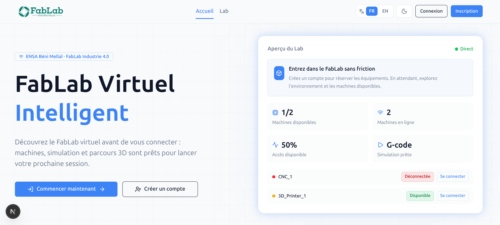
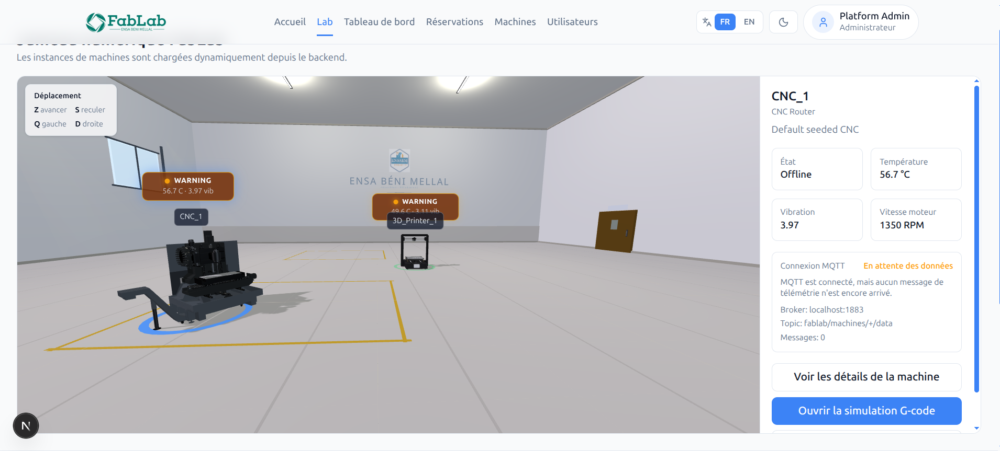
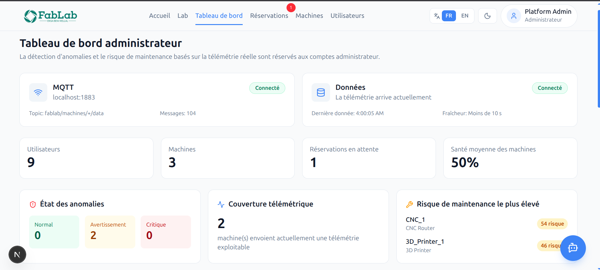
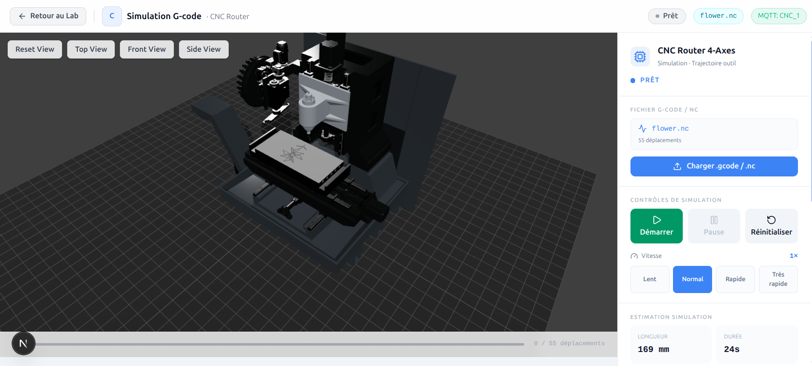
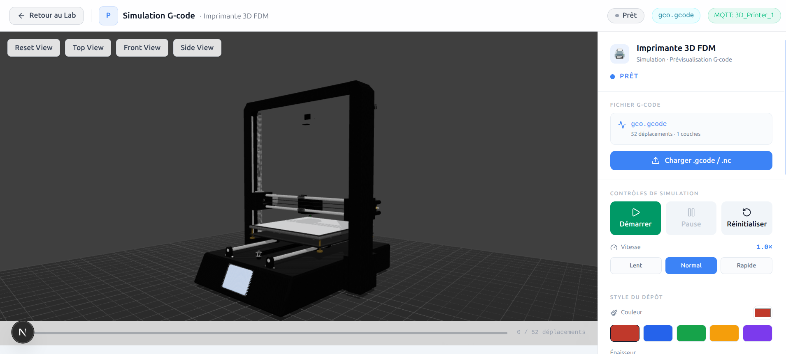
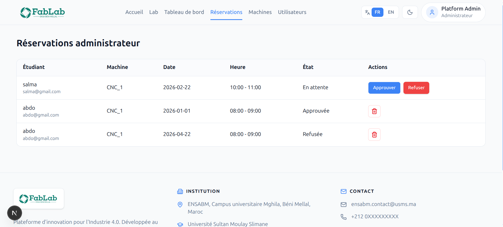
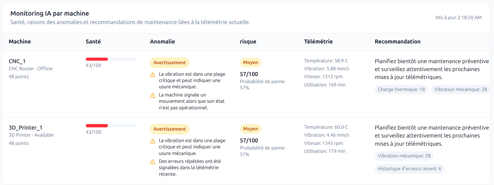
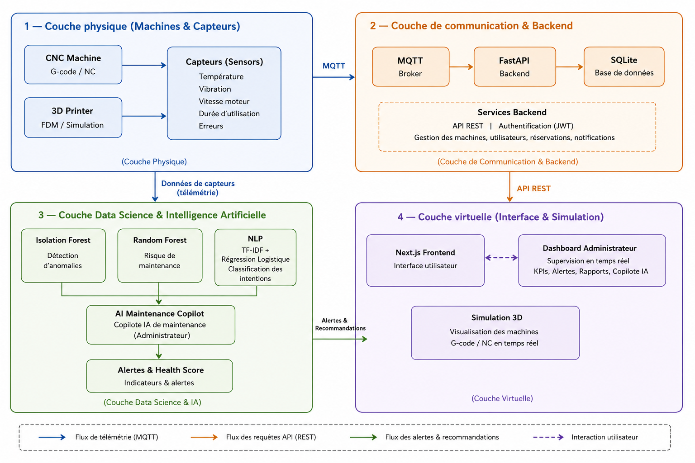

# Virtual FabLab - Digital Twin & Industry 4.0 Platform

<p align="center">
  
</p>

<p align="center">
  A connected FabLab platform for immersive machine exploration, live telemetry,
  G-code simulation, reservations, and AI-assisted maintenance monitoring.
</p>

<p align="center">
  <strong>Next.js 16</strong> · <strong>FastAPI</strong> · <strong>Three.js</strong> ·
  <strong>MQTT</strong> · <strong>SQLite</strong> · <strong>Scikit-learn</strong>
</p>

<p align="center">
  
</p>

## Overview

Virtual FabLab is a full-stack digital twin platform built for the FabLab at ENSA
Beni Mellal. It connects users, administrators, machines, and telemetry in one
web application.

Visitors can explore the virtual lab, students can reserve equipment and test
G-code, and administrators can supervise machines, reservations, users,
telemetry, anomalies, and maintenance risks.

## Latest Updates

- Improved CNC 4-axis simulation with synchronized tool-head and workspace motion.
- Refined CNC movement limits and simulation scene visuals.
- Added a bilingual forgot-password guidance page linked from login.
- Expanded English and French interface translations.
- Added machine-specific simulation controls, G-code validation, live telemetry,
  progress tracking, speed controls, and camera presets.

> The forgot-password page currently provides user guidance only. Email delivery
> and secure reset-token endpoints are not implemented yet.

## Features

| Area | Capabilities |
| --- | --- |
| Virtual Lab | Interactive 3D FabLab, machine selection, keyboard navigation, and live machine cards |
| G-code Simulation | Dedicated CNC and 3D-printer scenes, validation, animation, progress, estimates, and speed controls |
| Machine Monitoring | Live MQTT status, telemetry history, temperature, vibration, motor speed, and machine state |
| AI & Maintenance | Anomaly detection, machine-health overview, maintenance risk, and recommendations |
| Reservations | Student booking and cancellation flow plus admin approval and management |
| Administration | Dashboard, machine catalog, users, reservations, notifications, and role-aware access |
| User Experience | French/English interface, dark mode, responsive UI, authentication, profile, and password management |

## Gallery

<table>
  <tr>
    <td width="50%">
      
      <br><strong>Interactive 3D FabLab</strong>
    </td>
    <td width="50%">
      
      <br><strong>Administrator Monitoring Dashboard</strong>
    </td>
  </tr>
  <tr>
    <td width="50%">
      
      <br><strong>CNC G-code Simulation</strong>
    </td>
    <td width="50%">
      
      <br><strong>3D Printer G-code Simulation</strong>
    </td>
  </tr>
  <tr>
    <td width="50%">
      
      <br><strong>Machine Reservations</strong>
    </td>
    <td width="50%">
      
      <br><strong>AI Maintenance Predictions</strong>
    </td>
  </tr>
</table>

## Architecture

<p align="center">
  
</p>

```text
Browser / Next.js
        |
        | REST API
        v
FastAPI Backend ------ SQLite
        |
        | MQTT subscribe
        v
MQTT Broker <--------- Machines / Telemetry Simulator
        |
        v
Telemetry Processing / ML Models / Maintenance Recommendations
```

The frontend communicates with FastAPI through REST endpoints. The backend
subscribes to machine telemetry through MQTT, stores operational data in SQLite,
and exposes monitoring and AI results to the administrator dashboard.

## Tech Stack

**Frontend**

- Next.js 16, React 19, and TypeScript
- Tailwind CSS 4, shadcn/ui, Radix UI, and Lucide
- Three.js, React Three Fiber, and Drei
- Recharts and TanStack Query

**Backend**

- FastAPI, Uvicorn, SQLModel, and Pydantic
- SQLite and JWT authentication
- Paho MQTT
- Pandas, NumPy, Scikit-learn, and Joblib

## Project Structure

```text
PFE_Projet/
├── backend/
│   ├── app/
│   │   ├── core/               Configuration and security
│   │   ├── models/             SQLModel database models
│   │   ├── routes/             REST API endpoints
│   │   ├── schemas/            Request and response schemas
│   │   └── services/           Auth, MQTT, telemetry, and AI logic
│   ├── data/                   Telemetry datasets
│   ├── ml_models/              Trained model files
│   ├── scripts/                MQTT simulator and ML training
│   ├── requirements.txt
│   └── run.py
├── Frontend/
│   ├── app/                    Next.js App Router pages
│   ├── components/             UI, auth, 3D lab, and simulation components
│   ├── lib/                    API client, translations, and simulation logic
│   ├── public/models/          CNC and 3D-printer GLB models
│   ├── public/sample-gcode/    Example G-code and NC programs
│   └── package.json
└── Rapport_PFE/
    ├── content/                Report chapters
    └── images/                 Diagrams and application screenshots
```

## Getting Started

### Prerequisites

- Node.js 20+
- Python 3.10+
- npm
- An MQTT broker such as Mosquitto for live telemetry features

### 1. Start the Backend

```bash
cd backend
python3 -m venv .venv
source .venv/bin/activate
pip install -r requirements.txt
python run.py
```

The API starts at [http://localhost:8000](http://localhost:8000), and the
interactive API documentation is available at
[http://localhost:8000/docs](http://localhost:8000/docs).

### 2. Start the Frontend

Open a second terminal:

```bash
cd Frontend
npm install
npm run dev
```

Open [http://localhost:3000](http://localhost:3000).

### 3. Start Live Telemetry

Start your MQTT broker, then run the included simulator:

```bash
cd backend
source .venv/bin/activate
python3 scripts/mqtt_simulator.py \
  --broker-host localhost \
  --broker-port 1883 \
  --interval 4 \
  --machines "3D_Printer_1,CNC_1"
```

The simulator publishes machine data to:

```text
fablab/machines/{machine_id}/data
```

Example payload:

```json
{
  "machine_id": "CNC_1",
  "temperature": 52.94,
  "vibration": 4.27,
  "usage_duration": 32,
  "motor_speed": 1331.13,
  "error": null,
  "timestamp": "2026-05-10T16:01:22Z",
  "status": "RUNNING"
}
```

## Configuration

Create `Frontend/.env.local` when the API is running on another host:

```bash
NEXT_PUBLIC_API_BASE_URL=http://YOUR_PC_IP:8000
```

Without this variable, the frontend uses the browser's current hostname with
port `8000`. This makes it convenient to open the platform from another computer
on the same network.

Backend defaults are defined in `backend/app/core/config.py`, including the
database URL, CORS rules, MQTT host, port, and topic pattern.

## Default Admin Account

The backend seeds an administrator when the database is initialized:

```text
Email:    admin@fablab.ma
Password: Admin@123
```

Change these credentials and the default backend secret before any production
deployment.

## Main Routes

| Frontend Route | Purpose |
| --- | --- |
| `/` | Public home page |
| `/lab` | Interactive 3D FabLab |
| `/simulation` | CNC and 3D-printer G-code simulation |
| `/machines` | Machine catalog |
| `/machines/[id]` | Machine details and telemetry |
| `/reservations` | Student reservations |
| `/admin/reservations` | Admin reservation management |
| `/dashboard` | AI and telemetry monitoring dashboard |
| `/users` | Admin user management |
| `/profile` | User profile and password settings |
| `/login` | Authentication |
| `/register` | Account registration |
| `/forgot-password` | Password recovery guidance |

Important backend endpoint groups:

```text
/auth                 Authentication and profile
/machines             Machine catalog and state
/reservations         Student reservations
/admin                Admin users and reservation management
/notifications        User notifications
/monitoring           Telemetry and MQTT status
/simulation           Saved simulation state
/admin/ai             AI monitoring and model operations
```

## Useful Commands

```bash
# Frontend
cd Frontend
npm run lint
npm run build

# Backend
cd backend
source .venv/bin/activate
uvicorn app.main:app --reload
python3 scripts/train_ml_models.py
```

## Notes

- Admin pages and AI monitoring endpoints require an administrator account.
- Authentication tokens are stored in browser local storage.
- The backend initializes and seeds the local SQLite database automatically.
- Sample programs are available in `Frontend/public/sample-gcode/`.
- The report source and additional diagrams are available in `Rapport_PFE/`.
